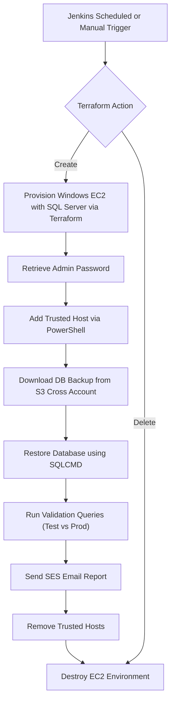

# Automated MS SQL Backup & Restore Pipeline

## 📘 Overview

This repository contains an end-to-end **automated Microsoft SQL Server Backup and Restore system**, orchestrated via **Jenkins Pipeline**, **Terraform**, and **PowerShell scripts**.

It enables:
- On-demand or scheduled deployment of a **Windows EC2 instance** with SQL Server.
- Automated **S3-to-EC2 database backup transfer** using AWS CLI and cross-account IAM roles.
- Secure **database restore** and **query validation** between Test and Production.
- Fully automated cleanup and reporting with **AWS SES email notifications**.

---

## ⚙️ Key Functionalities

### 🧩 Jenkins Pipeline (Groovy)
- **Parametrized build** with selectable database (`DB001.Global`, `DB002.Global`, etc.) and Terraform actions (`Create`, `Delete`).
- **Automatic environment provisioning** (EC2 + VPC) via Terraform.
- **Secure IAM role-based cross-account data transfer** between S3 buckets.
- **Remote PowerShell orchestration** using WinRM (add/remove trusted hosts).
- **Automated SQL restore**, validation queries, and result comparison.
- **Error recovery** and **failure notifications** via AWS SES.
- **Clean workspace** and environment teardown post-success.

### ☁️ Terraform Modules
- **`modules/vpc`** – Creates VPC, subnet, route table, and Internet Gateway.
- **`modules/ec2-windows-sql`** – Deploys Windows Server 2019 with SQL Server 2022 Standard.
- Uses **`terraform_role_arn`** for secure, temporary **STS assume-role** execution.

### 🧠 PowerShell Scripts
- `add-trusted-host.ps1` / `remove-trusted-host.ps1` – Manage WinRM trusted hosts.
- `download-s3-backup-remote.ps1` – Downloads latest S3 backup to EC2.
- `restore-db-sqlcmd.ps1` – Restores SQL DB using SQLCMD.
- `execute-query.ps1` / `execute-query-prod.ps1` – Run verification queries.

### 🐍 Python Integration
- **`download-transfer-db.py`** – Transfers backups between S3 buckets using role chaining.
- **SES-based notifications** – Dynamic HTML reports sent on success/failure.

---

## 🔐 Security & Best Practices

| Area | Implementation |
|------|----------------|
| Cross-account access | IAM Role-based STS AssumeRole between source & destination accounts |
| Credentials management | Jenkins Credentials Binding for AWS and SQL logins |
| Data security | All S3 transfers and EC2 volumes encrypted |
| Remote access | WinRM trusted host control with add/remove enforcement |
| Error handling | Robust `try-catch` in Groovy, PowerShell, and Python |
| Post-build cleanup | Automated workspace and EC2 teardown |
| Logging | Timestamped logs across all layers |

---

## 🚀 Implementation Procedure

### 1️⃣ Prerequisites
- Jenkins with Terraform, AWS CLI, Python (boto3), and PowerShell.
- Jenkins credentials: AWS and GitHub SSH.
- IAM roles: `restore-rc-mainline` (Source) & `restore` (Destination).
- Pre-existing S3 backups.

### 2️⃣ Pipeline Setup
1. Place the Groovy file in Jenkins as a pipeline script.
2. Configure parameters: `TERRAFORM_ACTION` and `DB_GLOBAL`.
3. Ensure Terraform paths are correctly configured in Jenkins.

### 3️⃣ Terraform Infrastructure
- Provisions EC2 instance with SQL Server.
- Configures security groups, WinRM, AWS CLI.
- Retrieves and stores admin password securely.

### 4️⃣ Database Restore & Verification
1. Transfers backup from S3.
2. Downloads to EC2.
3. Restores DB using PowerShell + SQLCMD.
4. Compares query results between Test and Prod.
5. Sends SES HTML summary email.

### 5️⃣ Cleanup
- Removes trusted hosts.
- Destroys EC2 and workspace.
- Sends failure notification if needed.

---

## 📊 Flow Diagram (Mermaid)

---

## 🧩 Example Use Cases
- Nightly DB restore validation.
- Cross-account backup verification.
- Automated DR test pipelines.

---

## 🧑‍💻 Author
**Md. Sarowar Alam**  
Lead DevOps Engineer, Hogarth Worldwide  
📧 Email: sarowar@hotmail.com  
🔗 LinkedIn: [linkedin.com/in/sarowar](https://www.linkedin.com/in/sarowar/)

---